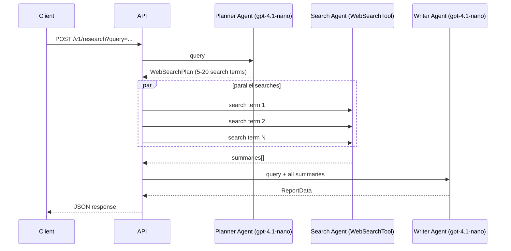

# API Endpoints

> **SDK Reference:** [OpenAI Agents Python](https://openai.github.io/openai-agents-python/)

All endpoints are served at `http://localhost:8000` by default. Interactive docs are available at `/docs` (Swagger UI) and `/redoc`.

---

## Base Endpoints

### `GET /`

Returns a welcome message confirming the service is running.

**Response**
```json
{
  "message": "Akin Chat API",
  "docs": "/docs"
}
```

---

### `GET /health`

Health check used by Docker and load balancers. Returns `200` when the app and database are reachable.

**Response**
```json
{
  "status": "healthy",
  "database": "connected"
}
```

Returns `503` if the database is unreachable.

---

## Chat Agent — `/v1/chat`

A plain conversational agent backed by `gpt-4.1-mini`. No tools, no handoffs. Full conversation history is persisted in PostgreSQL and replayed on each request.

---

### `POST /v1/chat/run`

Run the chat agent and receive the complete response once the model finishes.

**Request Body**
```json
{
  "input": "What is the capital of France?",
  "session_id": "550e8400-e29b-41d4-a716-446655440000"
}
```

| Field | Type | Required | Description |
|-------|------|----------|-------------|
| `input` | `string` or message list | Yes | User message or full message array |
| `session_id` | `uuid` | No | Existing session to continue. A new UUID is created if omitted. |
| `context` | `object` | No | Arbitrary context passed to the agent run |

**Response**
```json
{
  "final_output": "Paris is the capital of France.",
  "session_id": "550e8400-e29b-41d4-a716-446655440000",
  "usage": {
    "input_tokens": 42,
    "output_tokens": 11,
    "total_tokens": 53
  }
}
```

---

### `POST /v1/chat/stream`

Stream the chat agent's response as Server-Sent Events (SSE). The connection stays open until the model completes, emitting one event per token or agent action.

**Request Body** — same shape as `/run`.

**Response** — `Content-Type: text/event-stream`

Each line is a `data: <json>\n\n` SSE event. Event shapes:

#### Text delta (model is typing)
```json
{
  "event": "text_delta",
  "data": { "delta": "Paris" }
}
```

#### Tool called
```json
{
  "event": "tool_called",
  "data": {
    "tool_name": "search_knowledge_base",
    "tool_id": "call_abc123"
  }
}
```

#### Tool output
```json
{
  "event": "tool_output",
  "data": {
    "tool_id": "call_abc123",
    "output": "{\"chunks\": [...]}"
  }
}
```

#### Message output created
```json
{
  "event": "message_output_created",
  "data": {
    "role": "assistant",
    "content": "Paris is the capital of France."
  }
}
```

#### Agent updated (handoff)
```json
{
  "event": "agent_updated",
  "data": { "agent_name": "Assistant Agent" }
}
```

#### Stream complete
```json
{
  "event": "stream_complete",
  "data": {
    "final_output": "Paris is the capital of France.",
    "session_id": "550e8400-e29b-41d4-a716-446655440000",
    "usage": {
      "input_tokens": 42,
      "output_tokens": 11,
      "total_tokens": 53
    }
  }
}
```

#### Error
```json
{
  "event": "error",
  "data": { "message": "Internal server error" }
}
```

---

### `GET /v1/chat/session/{session_id}`

Retrieve all messages and aggregated token usage for a session.

**Path Parameters**

| Parameter | Type | Description |
|-----------|------|-------------|
| `session_id` | `uuid` | Session to query |

**Response**
```json
{
  "session_id": "550e8400-e29b-41d4-a716-446655440000",
  "messages": [
    {
      "role": "user",
      "content": "What is the capital of France?",
      "created_at": "2026-06-16T10:00:00Z"
    },
    {
      "role": "assistant",
      "content": "Paris is the capital of France.",
      "created_at": "2026-06-16T10:00:02Z"
    }
  ],
  "usage": {
    "total_input_tokens": 42,
    "total_output_tokens": 11,
    "total_tokens": 53
  }
}
```

---

### `DELETE /v1/chat/session/{session_id}`

Clear all messages for a session. The session record is kept; only messages are removed, effectively starting a fresh conversation on the same session ID.

**Response**
```json
{
  "status": "cleared",
  "session_id": "550e8400-e29b-41d4-a716-446655440000"
}
```

---

### `GET /v1/chat/info`

Returns metadata about the chat agent — useful for introspection and debugging.

**Response**
```json
{
  "name": "Chat Agent",
  "model": "gpt-4.1-mini",
  "instructions": "...",
  "tool_count": 0,
  "endpoints": {
    "run": "/v1/chat/run",
    "stream": "/v1/chat/stream",
    "session": "/v1/chat/session/{session_id}",
    "info": "/v1/chat/info"
  }
}
```

---

## Assistant Agent — `/v1/assistant`

A knowledge-base-grounded agent backed by `gpt-4.1-mini` with a single `search_knowledge_base` tool. When the user asks a factual question, the agent calls the RAG pipeline to retrieve relevant document chunks before composing an answer.

See [RAG.md](./RAG.md) for a full breakdown of how retrieval works.

All endpoints have the same shape as the Chat Agent endpoints above. Replace `/v1/chat` with `/v1/assistant`.

---

### `POST /v1/assistant/run`

Run the assistant and receive the complete response. If the model decides to retrieve context, the tool call is executed internally before the final answer is returned.

**Request / Response** — same shape as `/v1/chat/run`.

---

### `POST /v1/assistant/stream`

Stream the assistant's response. Tool-call events appear in the stream so the client can show a "searching knowledge base..." indicator.

**Request / Response** — same shape as `/v1/chat/stream`.

Example stream for a question that triggers RAG:

```
data: {"event": "text_delta",      "data": {"delta": ""}}
data: {"event": "tool_called",     "data": {"tool_name": "search_knowledge_base", "tool_id": "call_xyz"}}
data: {"event": "tool_output",     "data": {"tool_id": "call_xyz", "output": "{\"chunks\": [...]}"}}
data: {"event": "text_delta",      "data": {"delta": "Based on the documents,"}}
data: {"event": "text_delta",      "data": {"delta": " the answer is..."}}
data: {"event": "stream_complete", "data": {"final_output": "...", "session_id": "...", "usage": {...}}}
```

---

### `GET /v1/assistant/session/{session_id}`

**Request / Response** — same shape as `/v1/chat/session/{session_id}`.

---

### `DELETE /v1/assistant/session/{session_id}`

**Request / Response** — same shape as `/v1/chat/session/{session_id}`.

---

### `GET /v1/assistant/info`

**Response**
```json
{
  "name": "General Assistant",
  "model": "gpt-4.1-mini",
  "instructions": "...",
  "tool_count": 1,
  "endpoints": {
    "run": "/v1/assistant/run",
    "stream": "/v1/assistant/stream",
    "session": "/v1/assistant/session/{session_id}",
    "info": "/v1/assistant/info"
  }
}
```

---

## Research Pipeline — `/v1/research`

A multi-phase research workflow orchestrated by `ResearchManager`. Three agents run in sequence: a planner generates search queries, a search agent executes them in parallel, and a writer synthesises the results into a markdown report.

This endpoint does **not** support streaming — it waits for the full workflow to complete.

---

### `POST /v1/research`

**Query Parameters**

| Parameter | Type | Required | Description |
|-----------|------|----------|-------------|
| `query` | `string` | Yes | Research question or topic |

**Example Request**
```
POST /v1/research?query=How+do+transformer+models+handle+long+context
```

**Response**
```json
{
  "short_summary": "Transformer models handle long context through...",
  "markdown_report": "# How Transformer Models Handle Long Context\n\n## Introduction\n...",
  "follow_up_questions": [
    "What are the memory requirements of different long-context approaches?",
    "How does sparse attention compare to sliding window attention?"
  ]
}
```

| Field | Type | Description |
|-------|------|-------------|
| `short_summary` | `string` | 1-2 sentence executive summary |
| `markdown_report` | `string` | Full markdown report (1000+ words, 5-10 sections) |
| `follow_up_questions` | `string[]` | Suggested questions for deeper exploration |

**Workflow Phases**



---

## Common Patterns

### Continuing a conversation

Pass the `session_id` returned by any `/run` or `/stream` endpoint back in subsequent requests:

```bash
# First turn — no session_id, one is created
curl -X POST http://localhost:8000/v1/chat/run \
  -H "Content-Type: application/json" \
  -d '{"input": "My name is Alice."}'

# Response includes session_id: "abc-123"

# Second turn — pass session_id to continue
curl -X POST http://localhost:8000/v1/chat/run \
  -H "Content-Type: application/json" \
  -d '{"input": "What is my name?", "session_id": "abc-123"}'
# → "Your name is Alice."
```

### Consuming the SSE stream

```javascript
const response = await fetch('/v1/chat/stream', {
  method: 'POST',
  headers: { 'Content-Type': 'application/json' },
  body: JSON.stringify({ input: 'Tell me about Paris', session_id: null }),
});

const reader = response.body.getReader();
const decoder = new TextDecoder();

while (true) {
  const { value, done } = await reader.read();
  if (done) break;

  const lines = decoder.decode(value).split('\n');
  for (const line of lines) {
    if (!line.startsWith('data: ')) continue;
    const event = JSON.parse(line.slice(6));
    if (event.event === 'text_delta') process.stdout.write(event.data.delta);
    if (event.event === 'stream_complete') console.log('\nDone:', event.data.usage);
  }
}
```
