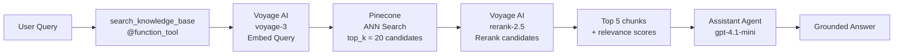

# RAG Pipeline

> **SDK Reference:** [OpenAI Agents Python](https://openai.github.io/openai-agents-python/)

The assistant agent uses a **Retrieve-and-Rerank** pipeline to ground answers in a curated knowledge base stored in Pinecone. Retrieval is exposed to the agent as a single `@function_tool`, letting the OpenAI Agents SDK decide when — and how many times — to call it during a turn.

---

## Overview



---

## Components

### 1. The `search_knowledge_base` Tool

**File:** `src/assistant/tools.py`

```python
@function_tool
async def search_knowledge_base(query: str, top_k: int = 5) -> str:
    ...
```

The tool is registered on the assistant agent using the [`@function_tool`](https://openai.github.io/openai-agents-python/tools/) decorator from the OpenAI Agents SDK. The SDK automatically:

- Generates a JSON schema from the function signature and docstring.
- Handles the tool-call / tool-result protocol with the model.
- Deserializes the model's arguments and calls the Python function.
- Feeds the return value back to the model as tool output.

The tool returns a JSON string so the model receives structured data (chunks with relevance scores, titles, and source URLs).

---

### 2. The Assistant Agent

**File:** `src/assistant/main.py`

```python
assistant_agent = Agent(
    name="General Assistant",
    instructions="""
        You are a helpful assistant. When the user asks a factual question,
        use the search_knowledge_base tool to retrieve relevant information
        before answering. Ground your answer in the retrieved documents.
    """,
    tools=[search_knowledge_base],
    model="gpt-4.1-mini",
)
```

The agent's system prompt instructs it to call `search_knowledge_base` for factual questions. The model decides autonomously whether a tool call is warranted — it can call the tool multiple times with different queries if needed, or skip it for conversational turns.

---

### 3. RAG Pipeline (`search_similar_chunks`)

**File:** `src/rag/simple.py`

The pipeline runs in three steps:

#### Step 1 — Embed the Query

The query string is converted to a dense vector using Voyage AI's `voyage-3` model. The `input_type="query"` parameter optimises the embedding for retrieval (as opposed to `"document"` used at index time).

```python
query_embedding = await embedder.get_embedding(texts=[query], input_type="query")
```

#### Step 2 — Approximate Nearest-Neighbour Search

The embedding is sent to Pinecone to retrieve the `RAG_CANDIDATE_K` (default **20**) most similar vectors. Each result includes the stored metadata: `title`, `summary`, `source`, `url`, `news_id`.

```python
results = await pinecone_client.query_document(
    vector=query_embedding,
    top_k=settings.rag_candidate_k,   # 20
    namespace=settings.pinecone_namespace,
    include_metadata=True,
)
```

The large candidate pool is intentional: Pinecone's ANN search optimises for speed, not cross-document relevance ordering. Fetching more candidates then reranking them produces significantly better precision at the final top-K.

#### Step 3 — Rerank

The 20 candidates are reranked by Voyage AI's cross-encoder model (`rerank-2.5`). Unlike the bi-encoder used for embedding, a cross-encoder sees both the query and each document simultaneously, producing a precise relevance score.

```python
reranked = await embedder.get_reranked_context(
    query=query,
    documents=candidate_texts,
    top_k=settings.rag_top_k,         # 5
)
```

Only the top `RAG_TOP_K` (default **5**) results are returned to the agent.

---

### 4. Vector Database (Pinecone)

**File:** `src/services/pinecone.py`

`AsyncPineconeClient` wraps Pinecone's `IndexAsyncio` client. All queries are fully async — the RAG pipeline never blocks the FastAPI event loop.

The index stores document chunks with the following metadata schema:

| Metadata field | Description |
|----------------|-------------|
| `title` | Document or article title |
| `summary` | Pre-computed chunk summary |
| `source` | Source name / publication |
| `url` | Original URL of the document |
| `news_id` | Internal document identifier |

---

### 5. Voyage AI Embedder

**File:** `src/services/voyage.py`

`VoyageEmbedder` implements the `Embedder` abstract interface defined in `src/contracts/embedder.py`, making it easy to swap for a different embedding provider without touching the RAG pipeline.

| Method | Model | Use |
|--------|-------|-----|
| `get_embedding(texts, input_type)` | `voyage-3` | Embed queries and documents |
| `get_reranked_context(query, docs, top_k)` | `rerank-2.5` | Cross-encoder reranking |

---

## Configuration

All RAG parameters are set via environment variables (see [README.md](./README.md)):

| Variable | Default | Description |
|----------|---------|-------------|
| `PINECONE_SERVERLESS_API_KEY` | — | Pinecone authentication |
| `PINECONE_INDEX` | — | Index name |
| `PINECONE_HOST` | — | Index host URL |
| `PINECONE_NAMESPACE` | `global` | Namespace within the index |
| `VOYAGE_API_KEY` | — | Voyage AI authentication |
| `VOYAGE_EMBED_MODEL` | `voyage-3` | Embedding model |
| `VOYAGE_RERANK_MODEL` | `rerank-2.5` | Reranking model |
| `RAG_TOP_K` | `5` | Final chunks returned to the agent |
| `RAG_CANDIDATE_K` | `20` | Candidates fetched from Pinecone |

---

## How the Agent Uses Retrieved Context

When the assistant calls `search_knowledge_base`, the tool returns a JSON string containing the top chunks:

```json
{
  "query": "What is retrieval-augmented generation?",
  "total": 5,
  "chunks": [
    {
      "title": "RAG: Retrieval-Augmented Generation for NLP",
      "summary": "RAG combines retrieval systems with generative models...",
      "source": "arxiv.org",
      "url": "https://arxiv.org/abs/2005.11401",
      "news_id": "doc_001",
      "relevance_score": 0.94
    }
  ]
}
```

The model then:

1. Reads the chunks and their relevance scores.
2. Synthesises an answer grounded in the retrieved content.
3. May cite `source` or `url` fields if configured to do so in the system prompt.
4. Returns the final answer to the user.

---

## Graceful Degradation

If Pinecone is not configured (missing API key or host), `search_similar_chunks` returns an error field instead of raising an exception:

```json
{
  "query": "...",
  "chunks": [],
  "total": 0,
  "error": "Pinecone not configured"
}
```

The agent continues normally — it will answer based on its own knowledge rather than retrieved context.

---

## Extending the Pipeline

The `Embedder` interface (`src/contracts/embedder.py`) defines two methods:

```python
class Embedder(ABC):
    async def get_embedding(self, texts: list[str], input_type: str) -> list[float]: ...
    async def get_reranked_context(self, query: str, documents: list[str], top_k: int) -> list[RankedDocument]: ...
```

To swap Voyage AI for a different provider (e.g. OpenAI embeddings, Cohere), implement this interface and inject the new embedder into `src/rag/simple.py`.
