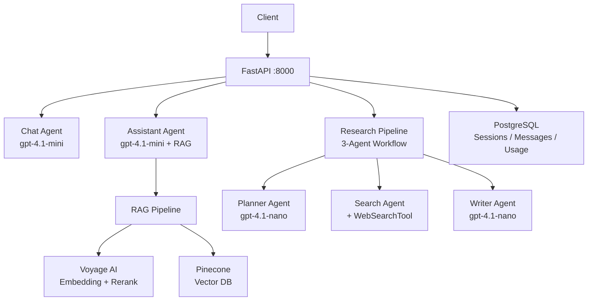
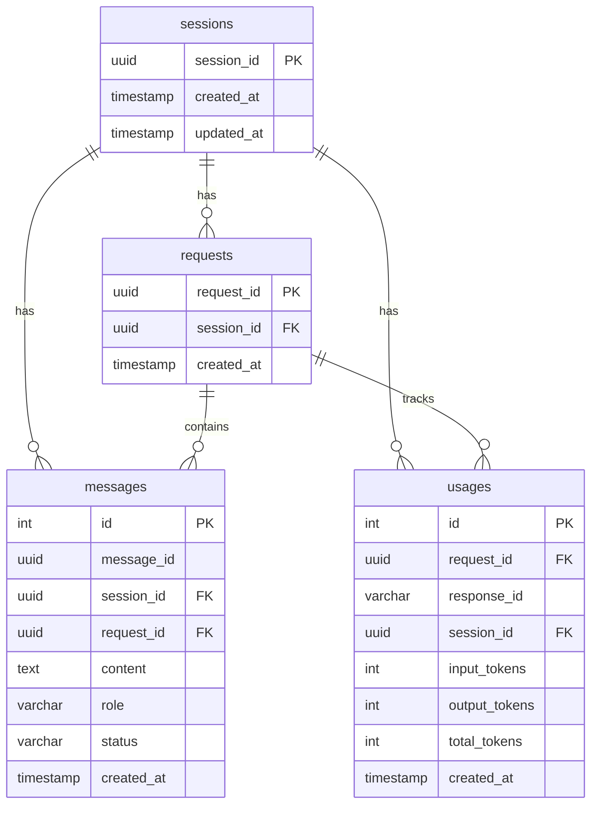

# Akin Chat — Setup & Running Guide

> **SDK Reference:** [OpenAI Agents Python](https://openai.github.io/openai-agents-python/)

Akin Chat is a multi-agent AI platform built on the [OpenAI Agents SDK](https://openai.github.io/openai-agents-python/). It exposes three independent agents — a conversational chat agent, a RAG-backed knowledge assistant, and a multi-phase web research pipeline — all served through a single FastAPI application with full PostgreSQL persistence and SSE streaming.

---

## Other Docs

| Doc | Description |
|-----|-------------|
| [API Endpoints](./API_ENDPOINTS.md) | All HTTP endpoints, request/response shapes, and streaming events |
| [RAG Pipeline](./RAG.md) | How the assistant agent retrieves and reranks knowledge base documents |
| [Environment & Secrets](./ENVIRONMENT.md) | Local, LocalStack prod simulation, and real AWS configuration |

---

## Architecture Overview



---

## Prerequisites

| Requirement | Version |
|-------------|---------|
| Docker | 24+ |
| Docker Compose | v2.x |
| OpenAI API key | — |
| Pinecone API key | Serverless index required |
| Voyage AI API key | — |

---

## Environment Variables

Create a `.env` file at the project root before starting any service. All variables are required unless marked optional.

```dotenv
# OpenAI
OPENAI_API_KEY=sk-proj-...

# PostgreSQL (used by Docker Compose; change if you point to an external DB)
POSTGRES_USER=postgres
POSTGRES_PASSWORD=postgres
POSTGRES_DB=akin_chat
POSTGRES_HOST=db          # service name inside Docker Compose network
POSTGRES_PORT=5432

# Pinecone
PINECONE_SERVERLESS_API_KEY=pcsk_...
PINECONE_INDEX=your-index-name
PINECONE_HOST=https://<index-host>.pinecone.io
PINECONE_NAMESPACE=global   # optional, defaults to "global"

# Voyage AI
VOYAGE_API_KEY=pa-...
VOYAGE_EMBED_MODEL=voyage-3
VOYAGE_RERANK_MODEL=rerank-2.5

# RAG tuning (optional)
RAG_TOP_K=5          # final results returned to the agent
RAG_CANDIDATE_K=20   # candidates fetched from Pinecone before reranking

# App (optional)
LOG_LEVEL=INFO
```

---

## Running with Docker

### Start all services

```bash
docker compose up --build
```

This brings up three containers:

| Container | Purpose | Port |
|-----------|---------|------|
| `db` | PostgreSQL 16 | 5432 |
| `pgadmin` | pgAdmin 4 web UI | 5050 |
| `app` | FastAPI application | 8000 |

The `app` container waits for PostgreSQL to be healthy, then runs `alembic upgrade head` before starting Uvicorn.

### Verify the app is running

```bash
curl http://localhost:8000/health
# {"status":"healthy","database":"connected"}
```

### Stop services

```bash
docker compose down
```

To also remove the database volume:

```bash
docker compose down -v
```

---

## Running in Development (without Docker)

### 1. Install dependencies

```bash
pip install poetry
poetry install
```

### 2. Start a local PostgreSQL instance

```bash
docker compose up db -d
```

### 3. Run migrations

```bash
alembic upgrade head
```

### 4. Start the app with hot reload

```bash
uvicorn src.app:app --reload --host 0.0.0.0 --port 8000
```

---

## Project Structure

```
akin-chat/
├── src/
│   ├── app.py              # FastAPI entry point, lifespan, router registration
│   ├── config.py           # Pydantic-settings: all env var configuration
│   ├── api/
│   │   ├── routers/
│   │   │   ├── agent_router.py   # Generic router factory for all agents
│   │   │   ├── assistant.py      # /v1/assistant router
│   │   │   ├── chat.py           # /v1/chat router
│   │   │   └── research.py       # /v1/research router
│   │   └── schemas.py            # AgentRequest, AgentResponse Pydantic models
│   ├── chat/
│   │   └── main.py         # Chat agent definition (gpt-4.1-mini, no tools)
│   ├── assistant/
│   │   ├── main.py         # Assistant agent definition (+ search_knowledge_base tool)
│   │   └── tools.py        # @function_tool wrapping the RAG pipeline
│   ├── research/
│   │   ├── manager.py      # ResearchManager: plan → search → write orchestration
│   │   └── agents/         # planner_agent, search_agent, writer_agent
│   ├── rag/
│   │   └── simple.py       # search_similar_chunks: embed → retrieve → rerank
│   ├── services/
│   │   ├── pinecone.py     # Async Pinecone client
│   │   └── voyage.py       # Voyage AI embeddings + reranking
│   ├── db/
│   │   ├── models.py       # SQLAlchemy ORM: sessions, requests, messages, usages
│   │   ├── database.py     # Async Database singleton
│   │   └── agent_session.py# SessionABC implementation backed by PostgreSQL
│   └── utils/
│       └── logging.py
├── alembic/
│   ├── env.py
│   └── versions/
│       └── 72e05dedbe30_init_tables.py
├── alembic.ini
├── Dockerfile
├── docker-compose.yml
├── entrypoint.sh           # Waits for DB, runs migrations, starts Uvicorn
├── pyproject.toml
└── .env
```

---

## Stack

| Layer | Technology |
|-------|-----------|
| Web framework | [FastAPI](https://fastapi.tiangolo.com/) + Uvicorn |
| Agent runtime | [OpenAI Agents SDK](https://openai.github.io/openai-agents-python/) |
| LLM | OpenAI `gpt-4.1-mini`, `gpt-4.1-nano` |
| Database | PostgreSQL 16 (async via `asyncpg`) |
| Migrations | [Alembic](https://alembic.sqlalchemy.org/) |
| ORM | SQLAlchemy 2 (async) |
| Vector DB | [Pinecone](https://www.pinecone.io/) serverless |
| Embeddings | [Voyage AI](https://www.voyageai.com/) (`voyage-3`, `rerank-2.5`) |
| Containerisation | Docker + Docker Compose |
| Dependency mgmt | Poetry |

---

## Database Schema

Alembic manages the schema. The initial migration (`72e05dedbe30`) creates four tables:



Running `alembic upgrade head` applies all pending migrations automatically. The `entrypoint.sh` script does this on every container start, making cold deploys safe.

---

## pgAdmin

Access pgAdmin at `http://localhost:5050` after `docker compose up`.

Default credentials are set in `docker-compose.yml`. Connect to the `db` service using host `db`, port `5432`, and the credentials from your `.env`.
